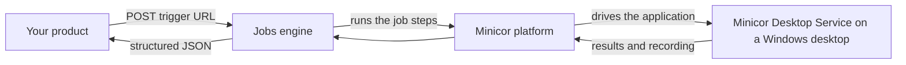

You call a job's trigger URL. Minicor runs the automation on a desktop. You get structured JSON back. That is the whole contract, and this page fills in just enough of the middle to reason about it.

## The path of a request

1. Your product calls the trigger URL with an API key and a JSON body.
2. The jobs engine, the service behind your trigger URLs, matches the request to your job and runs its steps in order. Most steps execute an automation on a desktop; some transform data between steps.
3. On the desktop, the Minicor Desktop Service drives the target application the way a person would, while recording the screen.
4. The result flows back as structured JSON. By default the call is synchronous; for long-running work you can ask for an execution ID and poll instead. See [Calling your job](/running/calling-your-job).

## What makes it reliable

The determinism of an API, the power of AI. The automation steps are deterministic code, built and tested against your real samples until every scenario passes. The intelligence is spent at teach time, not on every request. When something new does break in production, you teach the job the new case and the fix becomes a permanent scenario. See [Self-healing](/teaching/self-healing).

## The same platform, three ways in

- **The dashboard**, where you teach jobs, watch the builder, and go live.
- **The co-pilot**, a chat rail inside the dashboard that operates the platform for you. See [Co-pilot](/teaching/co-pilot).
- **The Minicor MCP**, the same tool surface exposed to your own coding agents. See [Connect an agent](/agents/mcp).

> Everything you can do in the dashboard, an agent can do through the MCP. The [For agents](/agents/mcp) section exists so agents can operate the platform end to end.
