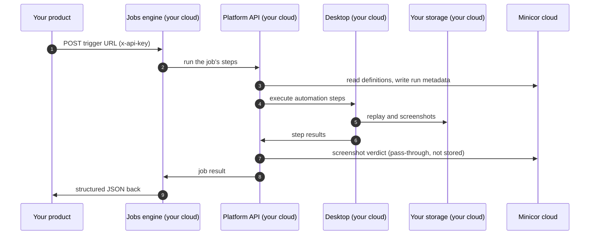

For customers handling regulated data, Minicor deploys the jobs engine and the stack around it inside your cloud project: the jobs engine, the platform API, the dashboard, the automation desktop, and the storage for replays and execution data. Sensitive data, PHI included, stays inside your boundary. We run this in production today for healthcare customers.

## What lives where

Inside your cloud project:

- The jobs engine serving your trigger URLs.
- The platform API and dashboard.
- The Windows desktop running the Minicor Desktop Service and the target application.
- Your storage buckets and database, holding replays, screenshots, and run payloads.

What crosses to Minicor cloud is coordination, not content:

| Crosses the boundary | What it contains |
| --- | --- |
| Job and automation definitions, run metadata | What the steps are and how runs went. No payload data. |
| Coordination state | Locks and run bookkeeping, so one run drives a desktop at a time. |
| The command bus | Instructions to the desktop and their results in transit. |
| Verification screenshots | Sent for a pass or fail verdict under BAA, passed through and not stored. |

Traffic in and out rides your edge (your CDN, WAF, and load balancers), and services inside the project talk to each other without leaving it. We provide a complete allowlist of every endpoint the deployment talks to, in both directions, so your network team can pin the boundary down and audit it.

## How a run flows

The payloads, the replays, and everything the automation read off the screen stay in your project. Minicor cloud sees that a run happened and how it went, not what was in it.

## What this takes

A deployment like this is set up together with your infrastructure team: a cloud project you own, a Windows VM for the desktop, and the network rules from the allowlist. Deployments update through your own CI/CD, so you control what ships and when. Talk to us at [connect@minicor.com](mailto:connect@minicor.com) to scope one.
